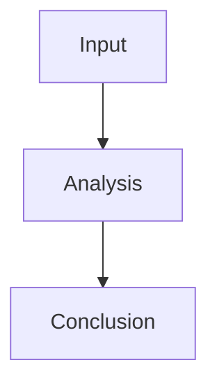

# AI Agent Instructions

This repository stores research outputs for the `ai_agentic_research` project.

## Research Output

- Keep research claims evidence-based. Prefer concrete source paths, modules, commands, commits, issues, pull requests, or documented observations over unsupported assertions.
- When a research result is easier to understand with a diagram, and the diagram can be expressed clearly in Mermaid, include it as an inline Mermaid code block in the markdown output.
- Use Mermaid diagrams only when they improve comprehension. Do not force diagrams for simple prose, tables, or conclusions that are clearer without graphics.
- Mermaid diagrams should be embedded directly in markdown with fenced code blocks:

````markdown

````
