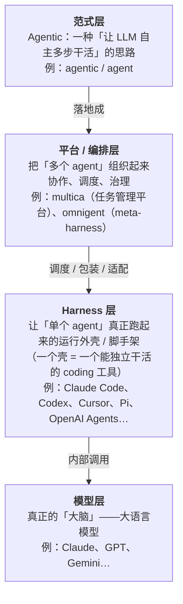
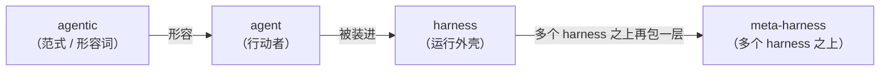
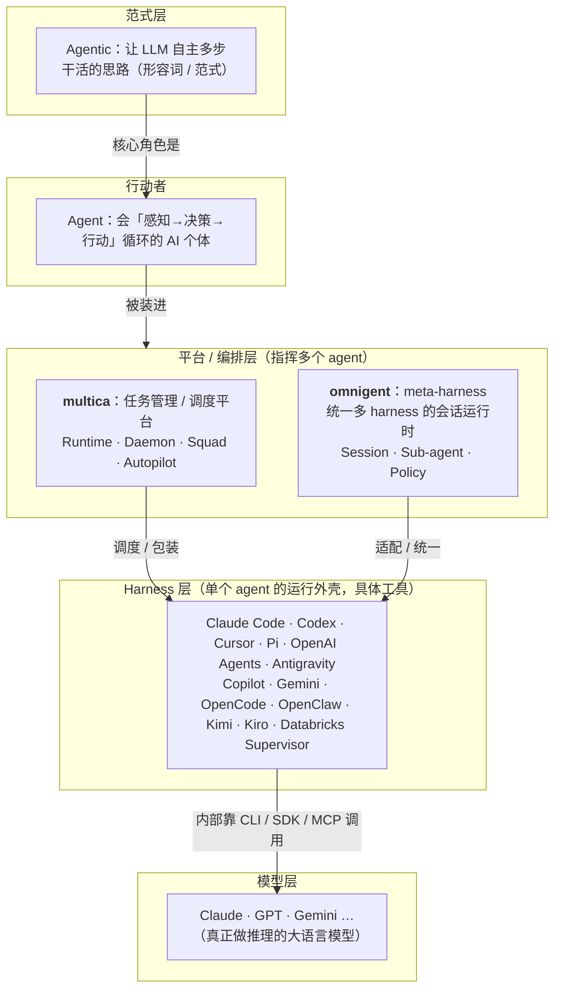
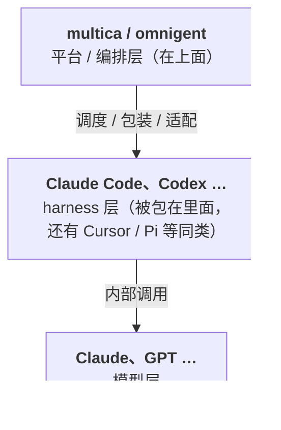
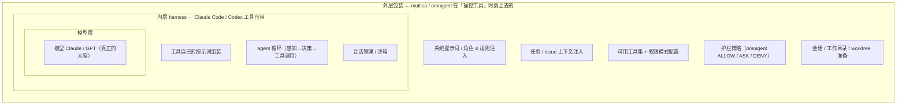

# 91 · 术语科普表（面向 AI 初学者）

> 本文档是面向 **AI 初学者** 的术语科普，**只解释 `ai_agentic_research` 调研文档里真实出现过的名词**（来源：`README.md` 与 `docs/00`~`docs/40`），不额外发挥。
>
> **与 [00-research-scope.md](00-research-scope.md) 术语表的关系**：`docs/00` 的术语表是给研究读者的**简明定义**（一行一条）；本文是它的**补充版 / 扩写版**——增加分层心智模型、`agent vs agentic vs harness` 等易混点辨析、Claude Code vs Codex 定位差异、嵌套 harness 视角、图示（mermaid）和速查表。两者不冲突，**本文不替换 `docs/00`**，遇到精确定义仍以 `docs/00` 与各 § 证据为准。
>
> **图示说明**：本文所有结构图统一使用 **mermaid** 代码块（以 `mermaid` 为语言标记的围栏代码块），在支持 mermaid 的 Markdown 渲染器（GitHub、多数文档站）里会渲染成图形；纯文本环境下直接读 mermaid 源码也能看懂层次。

---

## 0. 先建立一个分层心智模型

这些名词最容易混的原因是：它们**不在同一层**。有的是“思想/范式”，有的是“具体能跑的工具”，有的是“把工具跑起来的外壳”。一张图先把层次摆清楚：

记住这张图，后面每个名词你都能对号入座：它属于哪一层，就决定了它“是工具、是工具链、还是抽象概念”。

---

## 1. 三个最核心的抽象概念：agent / agentic / harness

这三个是文档的地基，也是用户最容易混的。它们**都不是某一个具体软件**，而是概念。

**① Agent（智能体）——【抽象概念：一个“行动者”】**
一个能“看情况 → 自己决定 → 动手执行”并循环多步的 AI 个体。它不只是回答问题，而是会调用工具、读写文件、跑命令去**完成任务**。
> 类比：一个能自己查资料、写代码、自己验证的“AI 员工”。

**② Agentic（智能体式的）——【抽象概念：一种范式/形容词】**
注意它是**形容词**，不是某个工具。意思是“具备 agent 那种自主多步特性的”。文档标题叫 *AI Agentic 工具研究*，“agentic 工具”指的就是“以 agent 为核心、能自主跑多步任务的系统”（见 `docs/00` 术语表）。
> 一句话区分：**agent 是名词（那个行动者），agentic 是形容词（那种自主干活的风格）。**

**③ Harness（运行外壳 / 脚手架）——【抽象概念 → 具体落地为工具】**
Harness 字面是“马具/挽具”。在这里指**把一个 agent 真正驱动起来所需要的那层外壳**：它负责接收任务、调用模型、执行工具调用、管理会话、处理输入输出。
> 类比：模型（LLM）是发动机，**harness 是包住发动机的整辆车**——方向盘、油门、仪表盘都在 harness 里。光有发动机你开不动，得有车壳。
> **Claude Code、Codex 这些，本质上就是一个个具体的 harness。**

**④ Meta-harness（元外壳）——【抽象概念：omnigent 的自我定位】**
“管理多个 harness 的更上层 harness”。omnigent 自称 meta-harness，意思是它在 Claude Code、Codex、Cursor、Pi 等**多个 harness 之上**再包一层统一的运行/会话/治理层，让你用一套接口驱动它们全部（见 `docs/20` §1）。
> 类比：harness 是“一辆车”，meta-harness 是“能统一调度各品牌车的车队总控台”。

**三者关系一句话**：

---

## 2. 具体工具：被包装的 AI coding 工具（harness 层）

这一类**都是真实存在、能独立安装运行的具体工具**。在调研里，它们的共同身份是“被 multica 包装 / 被 omnigent 适配”的对象。先讲用户点名的两个，再补文档里出现的其余同类（这就是用户说的“等等”）。

### 2.1 Claude Code vs Codex —— 定位差异（重点）

两者**处在同一层、是同类、互为竞品**：都是“单厂商出品的 agentic 编码命令行工具（CLI）”，自己就能在终端里读代码、改代码、跑测试。区别在背后的厂商和模型生态：

| | Claude Code | Codex |
| --- | --- | --- |
| 类型 | 具体工具（agentic coding CLI） | 具体工具（agentic coding CLI） |
| 厂商 | Anthropic | OpenAI |
| 背后模型 | Claude 系列 | OpenAI（GPT 系）系列 |
| 在 multica 里 | 作为一个外部 provider CLI 被调度（`server/pkg/agent/claude.go`） | 作为一个外部 provider CLI 被调度（`server/pkg/agent/codex.go`，`codex app-server`） |
| 在 omnigent 里 | 适配成 `claude-sdk` / `claude-native` harness | 适配成 `codex` / `codex-native` harness |

> 关键点：**Claude Code 和 Codex 不是 multica/omnigent 的竞品，而是被它们“包”在里面的零件。** multica/omnigent 在更上面一层，负责“指挥多个这样的工具协作”。

### 2.2 文档里出现的其余同类工具（用户的“等等”）

按它们在哪个工具里出现来分组——本质都属于“harness 层的具体 agent 工具”，区别只在厂商/模型/生态不同：

**multica 包装的外部 coding CLI**（见 `docs/10` §1、`docs/30` 对比表）：
- **Copilot** —— GitHub 的 AI 编程助手（的 CLI/agent 形态）。
- **Gemini** —— Google 模型；这里指其编码 CLI/agent 形态。
- **Cursor（Cursor Agent）** —— AI 代码编辑器 Cursor 的 agent/CLI 形态。
- **OpenCode、OpenClaw、Kimi、Kiro** —— 同属“被 multica 当作 provider 调度的外部 AI coding 工具”，差异在背后厂商/模型/生态（如 Kimi 出自 Moonshot 等）。文档只把它们列为 provider，未展开细节，这里按“同类工具”归类，不臆测各自内部实现。

**omnigent 适配的 harness（除 Claude/Codex/Cursor 外）**（见 `docs/20` §3、§7）：
- **Pi（pi / pi-native）** —— omnigent 支持的一种 agent harness。
- **OpenAI Agents（openai-agents）** —— OpenAI 的 Agents SDK，用来搭建 agent 的框架，被 omnigent 适配成一种 harness。
- **Antigravity** —— omnigent 注册表里的一种 harness（agentic IDE/运行时形态）。
- **Databricks Supervisor（databricks_supervisor）** —— omnigent 适配的一种“多 agent 监督者”harness。
- **GPT / Claude（在示例 agent Debby 里）** —— 这里不是工具名，而是直接指**模型**：示例 agent “Debby” 用 Claude 和 GPT 两个“脑袋”并行回答再互评（见 `docs/20` §7）。

> 小结：本节所有名字都在**同一层（harness/具体 agent 工具层）**。它们之于 multica/omnigent，就像各品牌电器之于一个“智能家居中控”——被统一接入、统一调度。

---

## 3. 工具链 / 基础设施类术语

这一类既不是“一个抽象范式”，也不是“一个能独立干活的 agent”，而是**支撑 agent 运行的技术零件或接口约定**。

| 术语 | 类型 | 初学者解释 |
| --- | --- | --- |
| **CLI**（命令行工具） | 工具形态 | Command-Line Interface，在终端里用命令操作的程序。Claude Code、Codex 都是 CLI。 |
| **SDK**（软件开发工具包） | 开发库 | 给程序员调用的代码库/接口。如 `claude-agent-sdk`、`openai-agents`，让你用代码而非命令行驱动 agent。 |
| **MCP** | 协议/接口 | Model Context Protocol，一套让 agent 标准化接入外部工具/数据源的协议。两个项目都用它扩展工具能力。 |
| **Provider / backend** | 角色称呼 | “被包装的那个外部 AI 工具”在 multica 里的统称（Claude Code、Codex… 都是一个 provider）。 |
| **Runner** | 运行组件 | omnigent 里负责“为每个会话拉起一个 harness 子进程”的执行器。 |
| **Sandbox（沙箱）** | 隔离机制 | 把 agent 的危险操作关进受限环境，防止它乱动系统。文档提到 Linux 的 **bwrap**、macOS 的 **seatbelt**，都是具体沙箱技术。 |
| **Spec / YAML / AgentSpec** | 配置 | 用一份 YAML 文件声明“这个 agent 叫什么、用哪个 harness、有哪些工具/权限”。omnigent 用它定义 agent。 |

---

## 4. 两个平台的“自家专有名词”

这些名词**只在各自项目里成立**，是它们的产品概念，别和通用术语混淆。

**multica 专有（任务管理平台侧）**：
- **Runtime（运行时）** —— `daemon × provider × workspace` 的执行单元；agent 绑定在某个 runtime 上才能干活。
- **Daemon（守护进程）** —— 跑在你电脑上的后台进程，负责探测本地 CLI、领取任务、准备工作目录、启动外部 agent。
- **Squad（小队）** —— “可被分配任务的对象 + 一个 leader agent 路由层”。任务给小队，先由 leader 读题再分派给成员。
- **Autopilot（自动驾驶/自动化）** —— 可定时/手动/webhook 触发的自动化任务。

**omnigent 专有（会话运行时侧）**：
- **Session / conversation（会话）** —— 一次 agent 运行的会话单元，可被 **attach（接管）/ fork（分叉）/ share（共享）**。
- **Sub-agent（子 agent）** —— 一个独立会话的子 agent，被纳入“会话树”，能并行、能带自己独立的 harness/model/工具（靠 `sys_session_send` 派生）。
- **Policy / Guardrails（策略/护栏）** —— 在 请求/响应/工具调用/工具结果 这些环节做 **ALLOW（放行）/ ASK（先问）/ DENY（拒绝）** 的治理规则。

> 一个易错点：multica 的 “Session 串行/恢复” 和 omnigent 的 “Session attach/fork” **用词相同但层次不同**，文档 [40-synthesis-and-judgments.md](40-synthesis-and-judgments.md) 待确认项里也专门标注了二者语义尚未逐行对齐——别默认它们是一回事。

---

## 5. 术语关系总览图

## 6. 一句话对照速查表

| 名词 | 它是什么 | 一句话 |
| --- | --- | --- |
| **agentic** | 抽象范式（形容词） | “能自主多步干活的”那种风格 |
| **agent** | 抽象概念（行动者） | 会自己决策+动手的 AI 个体 |
| **harness** | 抽象概念 → 落地为工具 | 驱动单个 agent 跑起来的运行外壳 |
| **meta-harness** | 抽象概念（omnigent 定位） | 统管多个 harness 的上层外壳 |
| **Claude Code** | 具体工具（CLI） | Anthropic 出的 agentic 编码工具 |
| **Codex** | 具体工具（CLI） | OpenAI 出的 agentic 编码工具，与 Claude Code 同层互为竞品 |
| **Cursor/Pi/OpenAI Agents/Antigravity/Databricks Supervisor** | 具体工具/harness | omnigent 适配的其它 agent 运行外壳 |
| **Copilot/Gemini/OpenCode/OpenClaw/Kimi/Kiro** | 具体工具（CLI） | multica 调度的其它外部 AI coding 工具 |
| **GPT/Claude（示例里）** | 模型 | 真正做推理的大脑，不是工具名 |
| **CLI / SDK / MCP** | 工具链/接口 | 命令行程序 / 开发库 / 工具接入协议 |
| **Provider·Runtime·Daemon·Squad·Autopilot** | multica 专有名词 | 平台内部的角色/执行/编排概念 |
| **Session·Sub-agent·Policy/Guardrails** | omnigent 专有名词 | 会话/子 agent/治理护栏 |
| **Sandbox（bwrap/seatbelt）** | 隔离机制 | 把 agent 关进受限环境保安全 |

---

## 7. 分层补充：到底是「谁的」harness 层

> 本节与 §8 来自本研究 issue（GHO-54）线程中针对读者追问的两条概念澄清，整理落盘到此。

一个常见的理解偏差是：把 “Claude Code / Codex 属于 harness 层” 误读成 “multica / omnigent 这两个平台的 harness 层就只是 Claude Code / Codex”。需要分清**「谁的」harness 层**：

- ✅ **Claude Code / Codex 确实就在 harness 层** —— 它们是“驱动单个 agent 跑起来的运行外壳”的具体实例，这点没问题。
- ⚠️ **但它们是 multica / omnigent 所「驾驭 / 包装」的那个 harness 层，不是平台自身的内部分层。** multica 把它们当作 **provider** 调度，omnigent 把它们**适配成 harness**——这两个平台本身处在 harness 层**之上**（编排层）。
- 🔁 **harness 层不止这两个。** Claude Code / Codex 只是最典型的两个例子，同层还有 Cursor、Pi、OpenAI Agents、Copilot、Gemini、OpenCode、Kimi 等（见 §2）。

文档里的层次关系（平台在上、harness 被包在里面、模型在最里）：

一句话：✅「Claude Code / Codex 属于 harness 层」成立；⚠️ 但它们是 multica / omnigent **包装的对象**、是 harness 层的两个代表，不能反过来说“这两个平台的 harness 层就只是 Claude Code / Codex”。

---

## 8. 嵌套 harness 模型：内层（工具自带）+ 外层（平台包装）

harness 不是一个“单层盒子”，它是**可以层层嵌套**的。以 Claude Code / Codex 为例，真正驱动一个 agent 跑起来的，是「**工具自带的内层 harness ＋ 平台操控工具时加的外层包装**」两部分合在一起：

- **内层 harness（工具自带）**：Claude Code / Codex 工具本身就已经是一套完整 harness——内部自带**提示词组装、agent 循环（感知→决策→工具调用）、会话管理、沙箱**。
- **外层包装（平台裹上去的）**：当 multica / omnigent 去“驱动”这个工具时，会在它外面再裹一层，包括 **系统提示词 / 角色 & 规则注入、任务 / issue 上下文注入、可用工具集 + 权限模式配置、护栏策略（omnigent 的 ALLOW/ASK/DENY）、会话 / 工作目录 / worktree 准备**。

**和 §7 的衔接（一个澄清）**：§5/§7 把 multica / omnigent 画在 harness 层“之上”的编排层，这跟“外层包装也算一层 harness”并不矛盾——因为 harness 本质是个**功能性、可嵌套**的概念：平台层做的提示词 / 上下文 / 策略包装，本质上就是套在“工具自带内层 harness”外面的一层“外层 harness”。

> **活证据（运行时 brief 即「提示词外包装」的实样本）**：本任务由 multica 拉起 Claude Code 执行，平台在拉起时把一大段系统提示词 / 规则（项目的 `CLAUDE.md`、squad 协议、运行时 brief）注入了进来——agent 之所以“知道自己是什么角色、要先分诊再委派、用某种格式回评论”，正源于这段注入。**这段注入的提示词，就是 multica 给工具加的「外层包装」的活样本。**

**证据边界（须标注）**：
- “提示词注入是外层包装” 这一判断在**概念层面成立**，并有**运行时 brief 这个活证据**支撑。
- 但 glossary 与本研究文档（`docs/10`~`docs/40`）**已落盘的硬证据**只覆盖到「平台 / harness / 模型分层」与「omnigent 的策略 / 会话层」；**尚未**把“提示词等具体注入点”精确定位到源码（例如 multica `server/pkg/agent/claude.go` 的 prompt 拼装位置）。
- 因此本节的“嵌套 harness”视角属于**基于运行时观察的概念性归纳**，若需上升为带 `file:line` 的硬证据，建议由代码调查成员核验后再补注（见下方未决项）。

---

**信息来源**：均取自 `ai_agentic_research` 仓库的 `README.md` 与 `docs/00`~`docs/40`（术语表、对比表、各 § 证据）；§7、§8 另取自本研究 issue（GHO-54）线程中的两条概念澄清回复。

**需要标注的不确定点**：
- 文档仅把 OpenCode、OpenClaw、Kimi、Kiro 列为 multica 的 provider，未展开各自内部实现，本文按“同类外部 coding 工具”归类，未对其细节做断言；Pi、Antigravity、Databricks Supervisor 同理按“omnigent 注册的 harness”归类。如需精确到某一工具的厂商 / 能力，建议另起核查。
- **（§8 未决项）** “平台外层包装 = 一层外层 harness、提示词注入是其活样本” 属于基于运行时 brief 的概念性归纳；尚未把“提示词等具体注入点”定位到源码硬证据（如 multica `server/pkg/agent/claude.go` 的 prompt 拼装位置）。若要把这一视角升级为带 `file:line` 的硬证据，需由代码调查成员核验后补注。
